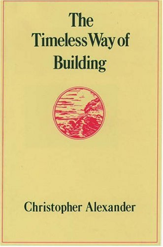
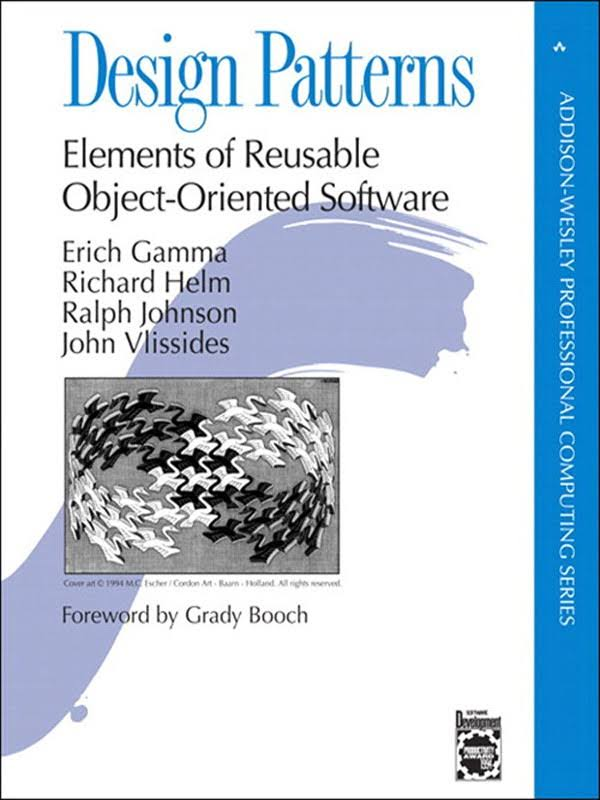

### Software Patterns in TensorFlow

Chicago, Feb 23, 2017

[Garrett Smith](http://gar1t.com) / [@gar1t](https://twitter.com/gar1t)

---

## About me

---

---

## It's Working <small>vs</small> It's Done

---

## TensorFlow Patterns

http://tensorflowpatterns.org

---

---

---

---

## Method

<ul>
<li class="fragment">A pattern should be used and something you can observe
<li class="fragment">A pattern should be repeated over enough time to inform your experience
<li class="fragment">A pattern must feel good when used
<li class="fragment">In some cases a pattern may be based on abstract thought without experience
</ul>

---

## Pattern: Function defined globals

http://www.tensorflowpatterns.org/patterns/function-defined-globals.html

---

## All together: MNIST <small>(Guild Examples)</small>

https://github.com/guildai/guild-examples/blob/master/mnist-2/intro.py

---

## Use and Contribute!

http://tensorflowpatterns.org

---

## Adding a pattern

<ul>
<li class="fragment">Note something you've observed routinely that you really like
<li class="fragment">Identify the distinction in what you like and give it a name (this is hard)
<li class="fragment">Fork https://github.com/guildai/tensorflow-patterns
<li class="fragment"><code style="font-size:0.7em">$ cp pattern.md.in patterns/your-pattern-name.md</code>
<li class="fragment">Fill in as many pattern details as you can in new file
<li class="fragment"><code style="font-size:0.7em">$ make spell-check</code>
<li class="fragment">Commit your change and open a GitHub pull request
</ul>

---

## Acceptance criteria

<ul>
<li class="fragment">Must apply to TensorFlow software development and use
<li class="fragment">Maintainers will merge your contribution in a timely manner (hours to days)
<li class="fragment">Maintainers will not make moral judgements about content
<li class="fragment">Other contributors may freely add to or modify your pattern
</ul>

---

## Links

- http://tensorflowpatterns.org
- https://github.com/guildai/guild-examples
- http://guild.ai
- http://tensorflow.org
